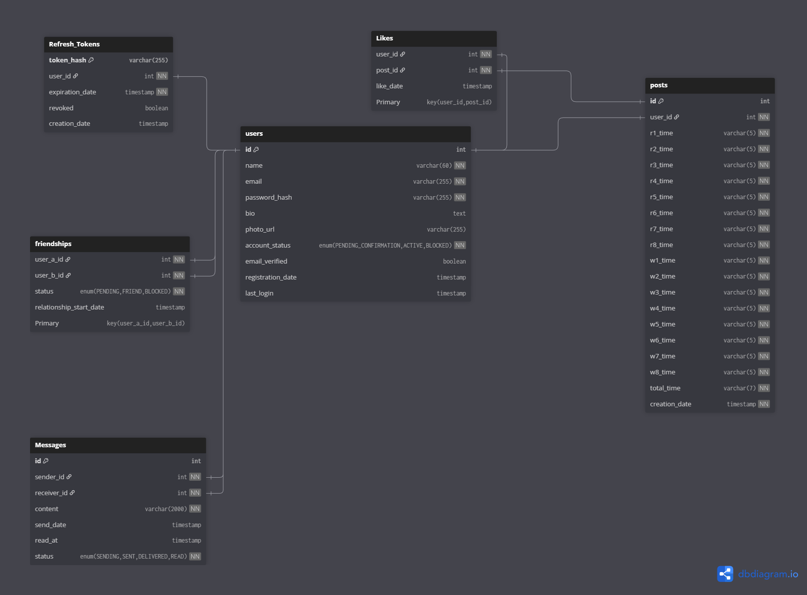

# Diseño de Base de Datos - TrainHub


## Tecnología
- **SGBD**: PostgreSQL 17
- **ORM**: Spring Data JPA (Hibernate)
- **Estrategia de DDL**: `spring.jpa.hibernate.ddl-auto: update` (desarrollo) / Migraciones (producción)

---

## Diagrama Entidad-Relación



---

## Tablas Detalladas

### 1. `users` - Usuarios

Almacena la información principal de los usuarios del sistema.

| Campo | Tipo | Restricciones | Descripción |
|-------|------|---------------|-------------|
| `id` | INT | PK, NOT NULL, GENERATED BY DEFAULT AS IDENTITY | Identificador único del usuario |
| `name` | VARCHAR(60) | NOT NULL | Nombre completo (2-60 caracteres) |
| `email` | VARCHAR(255) | UNIQUE, NOT NULL | Correo electrónico único |
| `password_hash` | VARCHAR(255) | NOT NULL | Contraseña hasheada (BCrypt) |
| `bio` | TEXT | NULL | Biografía (máx. 280 caracteres) |
| `photo_url` | VARCHAR(255) | NULL | URL de la foto de perfil |
| `account_status` | ENUM | NOT NULL | Estado: PENDING_CONFIRMATION, ACTIVE, BLOCKED |
| `email_verified` | BOOLEAN | NOT NULL, DEFAULT FALSE | Email verificado |
| `registration_date` | TIMESTAMP | NOT NULL, DEFAULT NOW() | Fecha de registro |
| `last_login` | TIMESTAMP | NULL | Último inicio de sesión |

**Índices:**
- `idx_users_username` en `name` (para búsquedas por nombre)

**Constraints:**
- `chk_users_name_length`: LENGTH(name) >= 2 AND LENGTH(name) <= 60
- `chk_users_bio_length`: bio IS NULL OR LENGTH(bio) <= 280
- `chk_users_account_status`: account_status IN ('PENDING_CONFIRMATION', 'ACTIVE', 'BLOCKED')

**Notas:**
- El campo `email` tiene constraint UNIQUE (índice automático)
- El campo `id` es auto-incremental usando `GENERATED BY DEFAULT AS IDENTITY`

---

### 2. `Refresh_Tokens` - Tokens de Refresco

Almacena los refresh tokens para autenticación JWT con capacidad de revocación.

| Campo | Tipo | Restricciones | Descripción |
|-------|------|---------------|-------------|
| `token_hash` | VARCHAR(255) | PK, NOT NULL | Hash del refresh token |
| `user_id` | INT | FK → users.id, NOT NULL | Usuario propietario |
| `expiration_date` | TIMESTAMP | NOT NULL | Fecha de expiración (7 días) |
| `revoked` | BOOLEAN | NOT NULL, DEFAULT FALSE | Token revocado |
| `creation_date` | TIMESTAMP | NOT NULL, DEFAULT NOW() | Fecha de creación |

**Índices:**
- `idx_refresh_tokens_user_id` en `user_id` (para validar tokens por usuario)
- `idx_refresh_tokens_expiration_date` en `expiration_date` (para limpieza automática de tokens expirados)

**Notas:**
- `token_hash` es la clave primaria
- Foreign key a `users.id` con `ON DELETE CASCADE`

---

### 3. `posts` - Publicaciones de Entrenamiento

Almacena las publicaciones con todos los tiempos directamente en la tabla (diseño denormalizado para rendimiento).

| Campo | Tipo | Restricciones | Descripción |
|-------|------|---------------|-------------|
| `id` | INT | PK, NOT NULL, GENERATED BY DEFAULT AS IDENTITY | Identificador único |
| `user_id` | INT | FK → users.id, NOT NULL | Usuario que creó la publicación |
| `r1_time` a `r8_time` | VARCHAR(5) | NOT NULL | 8 tiempos de running (formato MM:SS) |
| `w1_time` a `w8_time` | VARCHAR(5) | NOT NULL | 8 tiempos de workouts (formato MM:SS) |
| `total_time` | VARCHAR(7) | NOT NULL | Tiempo total roxzone (formato HH:MM:SS) |
| `creation_date` | TIMESTAMP | NOT NULL, DEFAULT NOW() | Fecha de creación |

**Índices:**
- `idx_posts_user_id` en `user_id` (para feed de usuario)
- `idx_posts_creation_date` en `creation_date DESC` (para ordenamiento del feed)
- `idx_posts_user_creation` en `(user_id, creation_date DESC)` - **Índice compuesto** (para feed optimizado)

**Constraints:**
- `chk_posts_total_time_format`: Valida formato de total_time (HH:MM:SS o MM:SS)

**Notas:**
- Diseño denormalizado: Tiempos almacenados como columnas en lugar de tablas relacionadas
- Foreign key a `users.id` con `ON DELETE CASCADE`
- Los tiempos se almacenan como VARCHAR para mantener formato legible

---

### 4. `friendships` - Relaciones de Amistad

Gestiona las relaciones de amistad entre usuarios.

| Campo | Tipo | Restricciones | Descripción |
|-------|------|---------------|-------------|
| `user_a_id` | INT | FK → users.id, NOT NULL | Primer usuario |
| `user_b_id` | INT | FK → users.id, NOT NULL | Segundo usuario |
| `status` | ENUM | NOT NULL | Estado: PENDING, FRIEND, BLOCKED |
| `relationship_start_date` | TIMESTAMP | NOT NULL, DEFAULT NOW() | Fecha de inicio de relación |
| **PK** | (user_a_id, user_b_id) | UNIQUE | Clave primaria compuesta |

**Índices:**
- `idx_friendships_user_a` en `user_a_id` (para consultas bidireccionales)
- `idx_friendships_user_b` en `user_b_id` (para consultas bidireccionales)
- `idx_friendships_user_a_status` en `(user_a_id, status)` - **Índice compuesto** (para filtrar amigos)
- `idx_friendships_user_b_status` en `(user_b_id, status)` - **Índice compuesto** (para filtrar amigos)

**Constraints:**
- `chk_friendships_user_order`: user_a_id < user_b_id (garantiza orden consistente)

**Triggers:**
- `trg_friendships_validate_order`: Valida y normaliza automáticamente que `user_a_id < user_b_id` antes de INSERT/UPDATE

**Notas:**
- Clave primaria compuesta garantiza unicidad del par
- Foreign keys a `users.id` (ambos campos) con `ON DELETE CASCADE`
- El trigger garantiza automáticamente que `user_a_id < user_b_id` para evitar duplicados

---

### 5. `Likes` - Likes en Publicaciones

Gestiona los likes de usuarios en publicaciones.

| Campo | Tipo | Restricciones | Descripción |
|-------|------|---------------|-------------|
| `user_id` | INT | FK → users.id, NOT NULL | Usuario que dio like |
| `post_id` | INT | FK → posts.id, NOT NULL | Publicación |
| `like_date` | TIMESTAMP | NOT NULL, DEFAULT NOW() | Fecha del like |
| **PK** | (user_id, post_id) | UNIQUE | Clave primaria compuesta |

**Índices:**
- `idx_likes_post_id` en `post_id` (para contar likes rápidamente)

**Notas:**
- Clave primaria compuesta garantiza que un usuario solo puede dar like una vez por publicación
- Foreign keys a `users.id` y `posts.id` con `ON DELETE CASCADE`

---

### 6. `Messages` - Mensajes del Chat

Almacena los mensajes privados entre usuarios.

| Campo | Tipo | Restricciones | Descripción |
|-------|------|---------------|-------------|
| `id` | INT | PK, NOT NULL, GENERATED BY DEFAULT AS IDENTITY | Identificador único |
| `sender_id` | INT | FK → users.id, NOT NULL | Usuario que envía |
| `receiver_id` | INT | FK → users.id, NOT NULL | Usuario que recibe |
| `content` | VARCHAR(2000) | NOT NULL | Contenido del mensaje (máx. 2000 caracteres) |
| `send_date` | TIMESTAMP | NOT NULL, DEFAULT NOW() | Fecha de envío |
| `read_at` | TIMESTAMP | NOT NULL, DEFAULT NOW() | Fecha de lectura (inicialmente igual a send_date) |
| `status` | ENUM | NOT NULL | Estado: SENDING, SENT, DELIVERED, READ |

**Índices:**
- `idx_messages_sender_id` en `sender_id` (para conversaciones)
- `idx_messages_receiver_id` en `receiver_id` (para conversaciones)
- `idx_messages_send_date` en `send_date DESC` (para ordenamiento)
- `idx_messages_sender_receiver_date` en `(sender_id, receiver_id, send_date DESC)` - **Índice compuesto** (para conversaciones)
- `idx_messages_receiver_sender_date` en `(receiver_id, sender_id, send_date DESC)` - **Índice compuesto** (para conversaciones bidireccionales)

**Constraints:**
- `chk_messages_sender_receiver`: sender_id != receiver_id (no enviarse mensajes a sí mismo)
- `chk_messages_content_not_empty`: LENGTH(TRIM(content)) > 0 (contenido no vacío)

**Triggers:**
- `trg_messages_update_read_at`: Actualiza automáticamente `read_at` cuando `status` cambia a 'READ'

**Notas:**
- Foreign keys a `users.id` (sender_id y receiver_id) con `ON DELETE CASCADE`
- No hay tabla de conversaciones separada; los mensajes se relacionan directamente entre usuarios
- El trigger actualiza automáticamente `read_at` cuando el mensaje es marcado como leído

---

## Relaciones (Foreign Keys)

Todas las foreign keys están configuradas con `ON DELETE CASCADE` para mantener la integridad referencial:

1. `Refresh_Tokens.user_id` → `users.id` (ON DELETE CASCADE)
2. `posts.user_id` → `users.id` (ON DELETE CASCADE)
3. `friendships.user_a_id` → `users.id` (ON DELETE CASCADE)
4. `friendships.user_b_id` → `users.id` (ON DELETE CASCADE)
5. `Likes.user_id` → `users.id` (ON DELETE CASCADE)
6. `Likes.post_id` → `posts.id` (ON DELETE CASCADE)
7. `Messages.sender_id` → `users.id` (ON DELETE CASCADE)
8. `Messages.receiver_id` → `users.id` (ON DELETE CASCADE)

**Nota**: Cuando se elimina un usuario, se eliminan automáticamente todos sus datos relacionados (tokens, posts, amistades, likes, mensajes).

---

## Índices Implementados

### Índices Simples (Críticos)

#### users
- `idx_users_username` en `name` - Para búsquedas por nombre

#### Refresh_Tokens
- `idx_refresh_tokens_user_id` en `user_id` - Para validar tokens por usuario
- `idx_refresh_tokens_expiration_date` en `expiration_date` - Para limpieza automática de tokens expirados

#### posts
- `idx_posts_user_id` en `user_id` - Para feed de usuario
- `idx_posts_creation_date` en `creation_date DESC` - Para ordenamiento del feed

#### friendships
- `idx_friendships_user_a` en `user_a_id` - Para consultas bidireccionales
- `idx_friendships_user_b` en `user_b_id` - Para consultas bidireccionales

#### Likes
- `idx_likes_post_id` en `post_id` - Para contar likes rápidamente

#### Messages
- `idx_messages_sender_id` en `sender_id` - Para conversaciones
- `idx_messages_receiver_id` en `receiver_id` - Para conversaciones
- `idx_messages_send_date` en `send_date DESC` - Para ordenamiento

### Índices Compuestos (Alta Prioridad)

#### posts
- `idx_posts_user_creation` en `(user_id, creation_date DESC)` - **Feed optimizado**: Filtra por usuario y ordena por fecha en una sola operación

#### friendships
- `idx_friendships_user_a_status` en `(user_a_id, status)` - **Filtrar amigos**: Consulta eficiente de amistades por usuario y estado
- `idx_friendships_user_b_status` en `(user_b_id, status)` - **Filtrar amigos**: Consulta bidireccional de amistades por usuario y estado

#### Messages
- `idx_messages_sender_receiver_date` en `(sender_id, receiver_id, send_date DESC)` - **Conversaciones**: Obtiene mensajes entre dos usuarios ordenados por fecha
- `idx_messages_receiver_sender_date` en `(receiver_id, sender_id, send_date DESC)` - **Conversaciones bidireccionales**: Permite consultar desde ambas perspectivas

**Nota**: PostgreSQL crea automáticamente índices para:
- Claves primarias (PK)
- Constraints UNIQUE (como `email` en `users`)

---

## Consideraciones de Implementación

### 1. Conversión de Tiempos
- Los tiempos se almacenan como VARCHAR para mantener formato legible
- Para cálculos, convertir a segundos en la aplicación:
  - `MM:SS` → segundos: `minutes * 60 + seconds`
  - `HH:MM:SS` → segundos: `hours * 3600 + minutes * 60 + seconds`

### 2. Validación de Friendships
- El trigger `trg_friendships_validate_order` garantiza automáticamente que `user_a_id < user_b_id`
- El constraint `chk_friendships_user_order` valida a nivel de base de datos
- Esto garantiza consistencia y evita duplicados sin necesidad de lógica en la aplicación

### 3. Mensajes
- No hay tabla de conversaciones; los mensajes se relacionan directamente entre usuarios
- Para obtener conversaciones, agrupar por pares de usuarios: `(sender_id, receiver_id)` o `(receiver_id, sender_id)`
- El trigger `trg_messages_update_read_at` actualiza automáticamente `read_at` cuando `status` cambia a 'READ'
- Los índices compuestos permiten consultas eficientes de conversaciones bidireccionales

### 4. Búsqueda de Usuarios
- El índice `idx_users_username` en `name` facilita búsquedas por nombre
- Para búsquedas más avanzadas, considerar índices FULLTEXT o GIN en PostgreSQL (futuro)

---

## Constraints de Validación Implementados

### users
- `chk_users_name_length`: Valida que el nombre tenga entre 2 y 60 caracteres
- `chk_users_bio_length`: Valida que la biografía no exceda 280 caracteres (si está presente)
- `chk_users_account_status`: Valida que el estado de cuenta sea uno de los valores permitidos

### posts
- `chk_posts_total_time_format`: Valida el formato de `total_time` (HH:MM:SS o MM:SS)

### friendships
- `chk_friendships_user_order`: Garantiza que `user_a_id < user_b_id` para evitar duplicados

### Messages
- `chk_messages_sender_receiver`: Impide que un usuario se envíe mensajes a sí mismo
- `chk_messages_content_not_empty`: Garantiza que el contenido no esté vacío (después de TRIM)

---

## Triggers Implementados

### 1. `trg_friendships_validate_order`
**Función**: `validate_friendship_order()`

**Propósito**: Valida y normaliza automáticamente que `user_a_id < user_b_id` antes de INSERT o UPDATE en `friendships`.

**Comportamiento**: Si `user_a_id > user_b_id`, intercambia los valores automáticamente para mantener consistencia.

**Justificación**: Evita duplicados y garantiza que las consultas bidireccionales funcionen correctamente sin necesidad de lógica en la aplicación.

### 2. `trg_messages_update_read_at`
**Función**: `update_message_read_at()`

**Propósito**: Actualiza automáticamente `read_at` cuando el `status` de un mensaje cambia a 'READ'.

**Comportamiento**: Si el status cambia a 'READ' y antes no lo era, actualiza `read_at` a la fecha/hora actual.

**Justificación**: Mantiene sincronizado el timestamp de lectura con el estado del mensaje sin necesidad de actualizaciones manuales.

---

## Vistas Implementadas

### 1. `posts_with_likes`
**Propósito**: Proporciona una vista de posts con el conteo de likes pre-calculado.

**Estructura**:
- Todas las columnas de `posts`
- `likes_count`: Número total de likes (0 si no tiene likes)

**Uso**: Facilita consultas del feed sin necesidad de hacer JOINs y COUNTs manualmente.

**Nota**: Esta vista puede ser útil para consultas frecuentes, aunque para el MVP podría no ser necesaria si se calcula el conteo en la aplicación.

### 2. `conversations_summary`
**Propósito**: Proporciona un resumen de conversaciones con el último mensaje de cada par de usuarios.

**Estructura**:
- `user_a_id`, `user_b_id`: Par de usuarios normalizado (user_a_id < user_b_id)
- `last_message_id`: ID del último mensaje
- `last_message_content`: Contenido del último mensaje
- `last_message_date`: Fecha del último mensaje
- `last_message_status`: Estado del último mensaje
- `last_message_sender_id`, `last_message_receiver_id`: IDs del remitente y receptor

**Uso**: Facilita la obtención de la lista de conversaciones con el último mensaje para mostrar en la interfaz de chat.

**Nota**: Adaptada a la estructura sin tabla `Conversations`, agrupando mensajes por pares de usuarios.

---

## Optimizaciones Futuras (No Implementadas)

Estas optimizaciones podrían considerarse según necesidades futuras:

- **Índices parciales**: Si hay muchas relaciones PENDING/BLOCKED en `friendships`, un índice parcial en `status = 'FRIEND'` podría ser útil
- **Índices FULLTEXT/GIN**: Para búsquedas avanzadas de usuarios por nombre o biografía
- **Particionamiento**: Para tablas grandes (`posts`, `Messages`) por fecha
- **Materialización de vistas**: Si las vistas se usan frecuentemente, considerar materializarlas

---

## Script de Inicialización

El script completo de inicialización de la base de datos se encuentra en `trainhub/init.sql`. Este script incluye:

1. Creación de tipos ENUM
2. Creación de todas las tablas
3. Foreign keys con `ON DELETE CASCADE`
4. Todos los índices (simples y compuestos)
5. Constraints de validación (CHECK)
6. Triggers de automatización
7. Vistas útiles

**Uso del script**:
```bash
# Desde el contenedor PostgreSQL
docker exec -i trainhub-postgres-1 psql -U postgres -d postgres < ./trainhub/init.sql

# O conectándose directamente
docker exec -it trainhub-postgres-1 psql -U postgres
# Luego ejecutar el contenido de init.sql
```

---

## Referencias

- [Architecture.md](Architecture.md) - Arquitectura del sistema
- [API_Design.md](API_Design.md) - Especificación de endpoints
- [Funcionalidades.md](Funcionalidades.md) - Requisitos funcionales
- `dbdiagram.sql` - Esquema fuente de la base de datos
- `trainhub/init.sql` - Script SQL completo de inicialización
